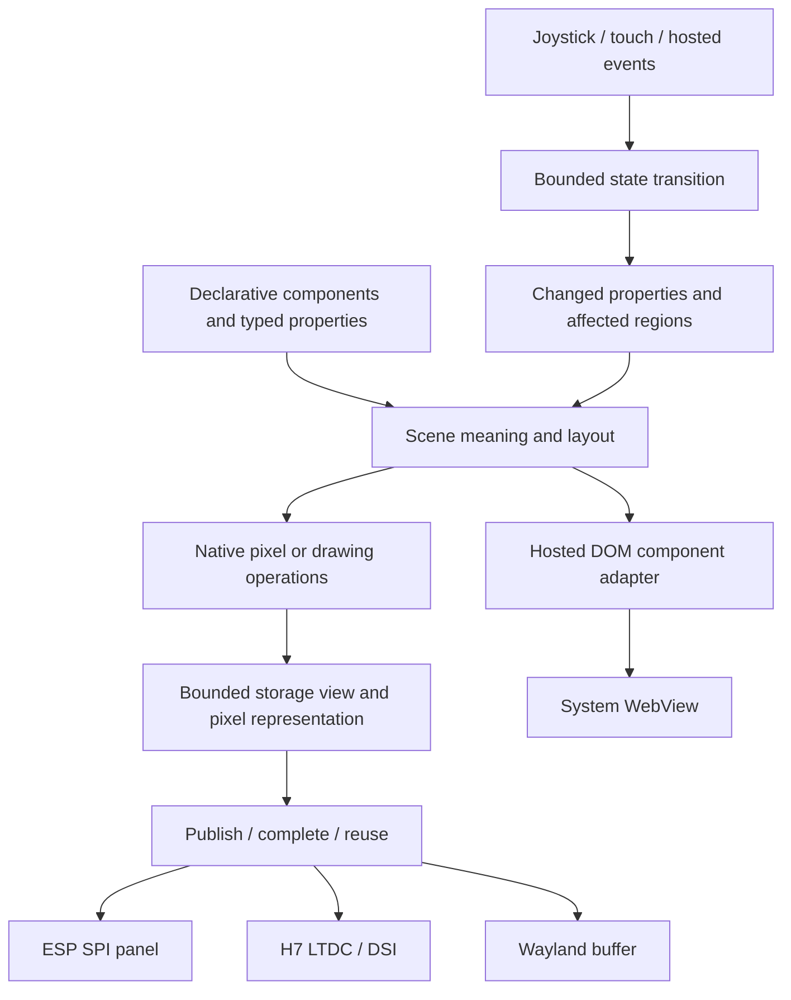

# A coherent UI and display model across Fidelity targets

Exploration dated 2026-09-12, with HelloDISCO observations updated 2026-09-13
and UI direction aligned with the 2026-09-18 architectural review,
grounded in the current HelloESP, HelloDISCO,
HelloWayland and WrenHello sources. This is a direction for incremental work,
not a new framework implementation or a claim of proved rendering.

The long-term objective is a coherent declarative UI model with efficient,
target-appropriate implementations whose storage and effects can be checked
through BAREWire, Fidelity.Platform, CCS and Composer. HelloDISCO now exercises
that direction with a logo, physical input and an explicit palette consumer.
Native Clef is the default path; LVGL/Skia bindings remain possible alternatives.

## The programming model and the display are separate contracts

The current [UI architectural review](../../Fidelity.UI/docs/08_ui_model_reconsideration.md)
selects cold functional descriptions and owned, demand-driven activation over a
shared semantic contract. The native direction is a new reactive-area engine;
WREN realizes the contract through the DOM/WebView. The
[component design](../../Fidelity.UI/docs/02_component_model.md) keeps computation
expressions optional over those same operations. An
[Elmish–signal hybrid](../../Fidelity.UI/docs/07_elmish_signal_hybrid.md) can provide
authoritative pure state transitions and selective projections where useful.
Neither CEs nor whole-model reducers are prerequisites for selective updates.

For HelloDISCO, pressing Up/Down changes the logo palette. An LED timer tick
changes LED phase without changing the logo. Its foreground palette consumer
compares the requested and applied palette and schedules work when they differ.
This small, explicit dependency is a useful first instance of the intended
reactivity, without importing an unaccepted signal runtime into the image.

The [Fidelity UI model](../../clef-lang-site/hugo/content/blog/fidelity-ui-model.md)
describes declarative controls and owned activation.
[Native reactivity in Clef](../../clef-lang-site/hugo/content/blog/native-reactivity-in-clef.md)
places incremental work in the language and framework's reactive foundation.
[Scaling FidelityUI](../../clef-lang-site/hugo/content/blog/scaling-fidelityui.md)
extends the design to independently owned views and services. Execution placement
and resource budgets remain explicit choices for each product.

The proposed cold description performs no mounting or subscription until an
explicit owner activates it. Mounted setup is distinct from repeatable pure
area updates. Invalidated derivations run when demanded; application-owned
service observation or scoped preparation can retain demand independently of
visibility. Closing a visual observer need not stop its service. The specified
`Effect.create` activates a sink, so a cold UI description defers that call until
owned activation. Static composition can be specialized, but dynamic children,
text, subscriptions and resource lifetime still require bounded state and an
implementation. Neither syntax surface implies zero allocations or proves its
update cost.



The arrows describe proposed ownership boundaries. A WebView adapter consumes
component/state meaning; it need not pretend to be a framebuffer. Likewise,
device initialization is implemented by selected native code, not synthesized
by LLVM from a generic widget name.

| Contract | Portable meaning | Target-owned obligations |
| --- | --- | --- |
| State and events | Actions, pure update, derived properties, bounded event policy | Physical input normalization; event delivery and scheduling |
| Composition and reactivity | Typed components/properties, layout, stable identity, changed regions | Accepted semantic operation lowering; bounded dependencies, ownership, demand and update execution; optional CE elaboration |
| Drawing | Shape/mask, logical color, clipping and coordinate transforms | Raster algorithm or supported hosted/accelerated realization |
| Storage | Extents, format, pitch, capacity, access lifetime | Actual representation, address, alignment, master reachability and cache policy |
| Presentation | Publication, completion, reuse and failure | SPI completion, LTDC reload/scanout, compositor release, or WebView lifecycle |

Fidelity.UI is the natural owner of reusable UI semantics. Hardware facts and
execution selections belong in Fidelity.Platform; storage/representation and
access contracts use BAREWire. The application owns its workload policy. CCS
and Composer must consume each supported contract and retain evidence for the
selected implementation. Introducing a descriptor without a consumer does not
establish its guarantee.

## Sweet Potato and the KeyStation panel

The [Sweet Potato port plan](SWEET_POTATO_UI_PORT.md) applies this model to the
AML-S905X-CC-V2 with the selected Waveshare 7.9inch HDMI LCD, SKU 17916.
The [panel entry](../Hardware/Products/Waveshare/7_9inch_HDMI_LCD/README.md)
records its HDMI/USB interfaces, ASIN and UPCs.
Native Meson display and touch integration precede a restricted Mali-450
renderer. CPU rendering supplies the reference for damage, clipping and alpha.
Linux provides a separately selected hosted route and hardware reference.

The [UI design](../../Fidelity.UI/docs/09_sweet_potato_keystation.md) keeps
component syntax independent of those drivers. Selected fades acquire temporary
clock demand, while an inactive panel can release visual demand and retain a
separately owned service projection. Device completion and display release
govern buffer reuse. The [board entry](../Hardware/Products/LibreComputer/AML_S905X_CC_V2/README.md)
records hardware identity, source evidence and the remaining acceptance gates.

## Current API implementation limits

The [Partas.Solid builder](../../Partas.Solid/Partas.Solid/Builder.fs) implements
its composition surface through Fable/JavaScript-specific machinery. That is
working source for the web path, not a native MCU dependency. WrenHello uses
direct Solid signals; it does not by itself demonstrate the entire proposed
Elmish/store hybrid.

Current [Fidelity.UI widgets](../../Fidelity.UI/src/Widgets.clef) are small
descriptor constructors. Its containers retain a child count, not a complete
child graph, and the [renderer](../../Fidelity.UI/src/Render.clef) is a partial
hosted implementation. Those files do not implement the shared component and
reactive-area design. Their historical comments about language support are not a
substitute for checking today's compiler.

[Fidelity.Signal's status](../../Fidelity.Signal/README.md#implementation-status)
explicitly marks its runtime-table/function-pointer implementation superseded.
The [reactive specification](../../clef-lang-spec/spec/reactive-signals.md)
and library README now agree on a thin surface over `Observable`/`Incremental`.
The compiler-visible dependency and lifetime design remains an implementation
obligation; it does not establish a working heapless MCU stabilization
implementation.
HelloDISCO should preserve a replaceable state/update boundary without choosing
that unimplemented machinery as a prerequisite for its logo.

The current [native checker](../../clef/src/Compiler/NativeTypedTree/NativeService.fs)
special-cases sequence expressions but handles a generic computation-expression
body as ordinary sequential expressions. Its
[binding checker](../../clef/src/Compiler/NativeTypedTree/Expressions/Bindings.fs)
does not elaborate `let!` as a builder `Bind`; computed child lists/arrays also
have explicit unsupported diagnostics. Therefore accepting CE-shaped syntax
would not establish correct builder semantics. A small builder case needs
elaboration and execution checks, including rejected unsupported cases.

Closure emission exists, but [current escape analysis](../../clef/src/Compiler/PSGSaturation/SemanticGraph/Escape.fs)
conservatively classifies ordinary capturing closures as escaping; the
[emitter](../../Composer/src/MiddleEnd/Alex/Witnesses/LambdaWitness.fs) allocates
that case. Heapless placement of retained reactive callbacks is not automatic.
Moreover, ordinary closure capture analysis excludes module globals. Reactive
dependency analysis must account for signal reads and conditional activation,
including module-level signals; a closure's stored environment alone is not
the complete reactive dependency graph.

## A small Elmish core with explicit change notifications

WrenHello supplies the useful first pattern: the native backend owns the count,
commands describe requested changes, and returned events drive a frontend
signal. Its current update logic lives inside the native bridge callback;
factoring it into a pure update function would make the boundary easier to test.
The shared protocol is already a single source file. Migrating its per-side
codecs to BAREWire should preserve that application meaning and separately
check representation, bounds, decode failures and delivery behavior. It should
not create a second authoritative counter in the frontend.

A bounded native experiment can establish these semantics without depending
on a complete native reactive library:

1. One normalized input message produces one pure model transition.
2. Compare named projections of the old/new model, then commit the new state.
3. Notify only consumers whose projection changed, with a coherent snapshot.
4. Schedule bounded effects separately from the pure update. A display consumer
   can coalesce superseded palette changes; input edge handling and future
   musical note events need their own explicit loss policy.

HelloDISCO already supplies the pure transition in `Behavior.step`; its packed
integer is an initial representation, not a proposed public Elmish API. A tiny
expression illustrates the shared projection idea:

```clef
let next = Behavior.step pressed current
let logoChanged = Behavior.logoPalette current <> Behavior.logoPalette next
```

This expression is a design example using existing functions. The
[interactive image](../../MCU/ST/STM32H747I-DISCO/HelloDISCO/experiments/interactive/README.md)
implements a fixed foreground palette consumer rather than a general subscriber
runtime: one batch keeps a stable selected palette, and later input can choose
the next batch. General messages, typed models and functional composition,
with optional CEs, can grow above the same semantics when their native lowerings
are accepted. For the first fixed graph, explicit projections provide
the desired change-notification behavior without claiming the compiler has
inferred a Signal dependency graph.

The useful acceptance cases are repeated/no-op updates, one notification after
a coherent multi-field change, an LED-only tick causing no logo notification,
palette wrap, stable rendering snapshots, and identical action traces through
native and hosted consumers. These remain acceptance questions for a reusable
reactivity layer. The current fixed consumer does not establish that broader
layer; rewriting WrenHello's bridge or building a general signal engine remains
outside HelloDISCO.

## What the four examples actually demonstrate

| Example | Current implemented boundary | Contribution to the common model |
| --- | --- | --- |
| [HelloESP](../../MCU/Espressif/CCC2026Badge/HelloESP/HelloESP.fidproj) | Native Clef framebuffer drawing, SPI panel transfer, buttons and RMT LEDs on LX7 | End-to-end small-device path; explicit conversion from logical pixels to wire bytes |
| [HelloDISCO interactive](../../MCU/ST/STM32H747I-DISCO/HelloDISCO/experiments/interactive/README.md) | Native M7 joystick/LED/palette image accepted, including debugger-disconnected cold start and controls | One foreground state/effect owner; immutable AXI index frame and palette changes while the LTDC layer is hidden |
| [HelloWayland](../../HelloWayland/HelloWayland.fidproj) | Native CPU rendering into scoped typed GBM views, joined worker regions, compositor-owned presentation | Actual stride/capacity checks, borrowed storage, dirty regions and distinct release events |
| [WrenHello](../../WrenHello/WrenHello.fidproj) | Native counter state, Partas.Solid frontend, shared protocol types, separate bridge codecs | Shared state/event vocabulary with a hosted renderer that owns the DOM |

HelloWayland's selected project now uses `src/Cpu/*`; the older 19-line widget
example in its README is not its current manifest. In
[MappedFill.render](../../HelloWayland/src/Cpu/Typed/MappedFill.clef), pixel
calculation writes through `BorrowedView.set`, and every worker retires before
the mapping closes. [CpuHost](../../HelloWayland/src/Cpu/Host.clef) uses actual
stride and buffer capacity, preserves untouched content, and waits for an
available slot. [CpuWindow.present](../../HelloWayland/src/Cpu/Window.clef)
explicitly distinguishes a frame callback from buffer release. The H7 needs
its own equally explicit completion rule.

WrenHello really compiles one [Protocol.fs](../../WrenHello/src/Shared/Protocol.fs)
through both its [Fable project](../../WrenHello/src/Frontend/Frontend.fsproj)
and Composer manifest. It shares types, not one renderer. Its current bridge
uses ASCII messages and WebKit script callbacks; the BAREWire/WebSocket wording
visible in some example UI text is a roadmap, not the implemented transport.
The [frontend](../../WrenHello/src/Frontend/App.fs) demonstrates native-owned
counter state and frontend-owned theme state. These ownership choices can be
expressed without requiring the two sides to share storage or object identity.

## Honest examples of the same code lowering differently

Both MCU applications contain these exact statements:

```clef
let handlers = { Tick = FnPtr.ofFunction tick }
install handlers.Tick
```

See [HelloESP Main](../../MCU/Espressif/CCC2026Badge/HelloESP/src/Main.clef) and
[HelloDISCO Main](../../MCU/ST/STM32H747I-DISCO/HelloDISCO/src/Main.clef).
The latter is the original GPIO-only selection; the newer interactive image
uses an assembly tick counter and keeps Clef state/effects in the foreground.
Both use a declared `FnPtr<int -> unit>` at the assembly boundary. The selected
adapter owns Xtensa interrupt entry or Cortex-M SysTick entry, register
preservation and idle behavior. This callback is a foreign/assembly boundary;
it is not a proposal to represent native reactive dependencies as raw pointers.

Both applications use `Mmio.bind32`, `Mmio.read32` and `Mmio.write32`. Their
retained LLVM artifacts contain volatile `i32` loads/stores. The Xtensa output
uses `l32i`/`s32i`; the M7 output uses Thumb `ldr`/`str`. Architecture-specific
ordering still needs its own contract: volatile does not establish cache
coherency or device handoff. The common compiler path is
[MmioPatterns](../../Composer/src/MiddleEnd/Alex/Patterns/MmioPatterns.fs), with
target selection in [LLVM lowering](../../Composer/src/BackEnd/LLVM/Lowering.fs).

The devices' register plans and protocols differ. An ESP SPI transaction is not
the same program as an H7 BSRR LED write, even though both use that MMIO API.
The accurate claim is shared language, access contract and lowering machinery,
with different concrete device operations.

The Clef logo has identical **1,352 mask bytes** in both applications, verified
by SHA-256 in the HelloDISCO tests. Its source files are adapted copies, and the
rendering algorithms differ. HelloDISCO's
[Scene.pixel](../../MCU/ST/STM32H747I-DISCO/HelloDISCO/src/Scene.clef) isolates
RGB565 pixel production; HelloESP currently owns its own mask/framebuffer loop.
There is not yet one common scene dependency selected by both MCU applications.

There is already literal reuse between HelloDISCO's ARM behavior code and its
[host tests](../../MCU/ST/STM32H747I-DISCO/HelloDISCO/tests/HelloDISCO.Tests.fsproj):
the tests compile unchanged `.clef` model files copied to `.fs` filenames.
That gives two compiler executions of the same behavior for comparison, not a
formal equivalence proof. Scene/Logo also execute through Composer on the host
and in the separate M7 static-display experiment; they remain absent from the
GPIO-only M7 executable. Halted board reads confirmed the generated frame's
complete pixel population, and the user confirmed the glyph on the panel.

## Representation and lifetime determine the implementation

HelloESP's current RGB565-valued `int array` is **81,920 bytes** in its optimized
LLVM allocation, while the SPI frame payload is **40,960 bytes**. The backing
elements are four bytes. `Array.zeroCreate` calls `calloc`, supplied by the
application's image-owned 128 KiB bump pool. Avoid describing this as an
allocation-free runtime merely because no vendor graphics library is linked.

H7's implemented glyph experiment uses one packed 416 × 416 RGB565 buffer:
346112 bytes at `0x24000040`, an 832-byte pitch and RGB565 LTDC format. Logo's
mask is an immutable scalar lookup, with no runtime array initialization. The
image checker inspects BSS placement below the reserved stack, the assembly
adapter's unsigned bound and halfword store, and the DSB publication call.
The native renderer writes that final buffer once; LTDC then scans the same
storage without a per-frame CPU copy. This establishes a concrete handoff,
not a general DMA ownership or cache-coherency proof. Caches remain disabled.

The [HelloDISCO display plan](../../MCU/ST/STM32H747I-DISCO/HelloDISCO/docs/DISPLAY_PLAN.md)
uses AXI SRAM and a smaller LTDC layer inside an 800 × 480 landscape stream.
It keeps full panel timing separate from the amount of memory allocated for the
logo. The screen driver's waits and rendering work must be bounded, and display
updates must use a stable state snapshot rather than race joystick/timer state.

The subsequent [banner variant](../../MCU/ST/STM32H747I-DISCO/HelloDISCO/experiments/banner-display/README.md)
uses the same driver and foreground loop with a 640 × 360 immutable RGB565
asset, centered at (80,60). Its final buffer occupies 460800 bytes. The complete
board readback equals the prepared asset, and the user confirmed the banner
returns after reconnecting CN2 without a debugger. This variant makes one
startup copy from flash into the final buffer; scanout requires no per-frame
CPU copy. It does not establish a general zero-copy graphics or signal runtime.

The [interactive variant](../../MCU/ST/STM32H747I-DISCO/HelloDISCO/experiments/interactive/README.md)
represents the accepted banner losslessly with 174 indexed colors: its L8
frame is 230400 bytes. Runtime palette changes leave that memory unchanged.
The foreground disables the layer at vertical blank, waits for completion,
writes 32 CLUT entries per observed tick for eight ticks, then re-enables the
layer at vertical blank. A background-only interval is intentional. The
non-shadowed palette port and startup pixel-clock prerequisite are documented
in the [CLUT supplement](../Hardware/Silicon/MCU/ST/STM32H7/STM32H747XIH6/docs/display/CLUT_SUPPLEMENT.md).

An intermediate image preserved the complete index frame across 33 palette
updates with zero observed DSI/LTDC error status and a largest foreground tick
gap of 1 ms. Those measurements do not establish worst-case execution time.
Cold start exposed corrupted initial colors despite correct geometry; Up/Down
restored the intended palette. The final image starts the configured L8
controller with its layer hidden and uses the same incremental palette state
machine before first visibility. The user confirmed a correct banner without
stripes immediately after CN2 unplug/reconnect, before joystick input, with
the debugger disconnected. Left/Right/Center LED controls are confirmed and
Up/Down palette operation was also observed.

The final 250190-byte image's ELF load segments and complete index frame match
readback; its [acceptance archive](../../MCU/ST/STM32H747I-DISCO/HelloDISCO/evidence/hardware/2026-09-13-interactive-initial-palette/readback-checks.json)
preserves those checks. The sequencing correction has passed this bounded
acceptance; it does not establish the hardware cause of the earlier corruption.
M7 audio/compute with M4 UI is a future split;
M4 boot and shared-memory/ownership contracts are not ready.

## Trust and proof boundaries

Native Clef is selected to make algorithms, writes and dependencies accessible
to the same analysis pipeline. It still belongs to the trusted implementation
where correctness is unproved and no isolation enforces the boundary. Likewise,
static linking changes packaging, not the validity of C writes or callbacks.

LVGL/Skia may be compared later as alternative rasterizers or component
implementations. Each needs an explicit capability/semantic mapping; neither
is simply interchangeable with a low-level panel presenter. A native display
path can proceed now without requiring or forbidding either binding.

| Obligation | Evidence to seek | Current limit |
| --- | --- | --- |
| UI meaning | Deterministic action traces, changed-property behavior, layout/coordinate checks | No general native semantic UI lowering accepted by this work |
| Numeric rendering | Explicit color/geometry representations, quantization rules, reference comparisons | Bounded integers or IEEE selection do not prove arbitrary rendering accuracy |
| CPU memory accesses | Capacity/pitch arithmetic, scoped views, actual element width and instructions | Source validity is not a whole-program memory-safety certificate |
| Device memory accesses | Master reachability, extents, publication/completion/cache obligations | Existing MMIO grants do not check general DMA ownership or program an MPU |
| Timing and recovery | Bounded work/waits, observability, interference measurements | Build success does not prove a display deadline or physical operation |

## Bounded next exploration

1. Preserve the accepted combined image, including debugger-disconnected cold
   start and controls. Keep its explicit foreground palette consumer, immutable
   frame and assembly-only tick counter as this checkpoint's bounded policy.
   Return to Clef language/compiler work for DSP and cryptography. The following
   UI items are later candidates.
2. Reference one small scene/asset implementation from both MCU workloads and
   retain paired target artifacts. Show genuinely identical source beside its
   different machine-code and storage realizations.
3. Exercise that scene through a host surface using HelloWayland's scoped-view
   pattern. Compare pixels and event traces independently from presentation.
4. Use these consumers to settle a minimal composition/reactivity contract:
   a fixed logo node, palette property and invalidated region, with bounded
   storage and execution. Add a CE surface only with actual lowering tests.
5. Extend toward synth controls and touch after those boundaries hold. General
   layout, dynamic lists, text shaping, signal scheduling and foreign renderer
   comparisons remain separate work.

This exploration leaves the full UI framework and general proof system open.
The working bounded consumer and its retained evidence can guide the shared
model after the language-readiness checkpoint.
