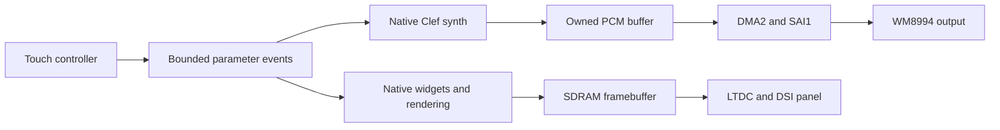

# STM32H747I-DISCO native Clef synthesizer

Design baseline: 2026-09-12. This is an analysis and scaffolding increment. The
goal is a Clef unikernel instrument with Minimoog-like sound characteristics,
audio output, display and capacitive touch. Hardware inventory should preserve
the board's full expansion potential; executable acceptance advances through
small, independently observable stages.

The initial implementation direction is native Clef DSP and a purpose-built
native UI, with narrow replaceable interfaces for optional foreign components.
The native display path is the default because it exposes bounds, storage and
handoffs to the verification tools. LVGL/Skia bindings remain optional research
paths. Static linking does not establish their memory safety or remove them
from the trusted computing base; native source also needs proof or isolation
before its correctness can be excluded from that trust assumption.
One Cortex-M7 image owns the first instrument. Using the M4 is a later workload
selection that requires its own image and inter-core contract.

## What is actually present

The initial audit found an incomplete source closure. This increment supplied
the minimum STM32H7 family, STM32H747XIH6 part, product and M7 environment
sources and corrected the core representations. The active application is now
[HelloDISCO](../../MCU/ST/STM32H747I-DISCO/HelloDISCO/README.md), with a
verified native LED/joystick image and a native LCD experiment. The user has
confirmed the landscape Clef banner and its return after reconnecting CN2 with
the debugger disconnected. Halted OpenOCD reads confirmed all 460800 framebuffer
bytes match the prepared asset. The generated orange glyph remains a fallback.
Broader peripheral inventory is not an
accepted full-device MMIO/protocol implementation.

The [source audit](../Hardware/Products/ST/STM32H747I_DISCO/docs/SOURCE_AUDIT.md)
identifies PDFs by their contents and records hashes. In particular DS12930 is
filed under the family as `stm32h747ag.pdf`, the part's `stm32h747i-disco.pdf` is
a board data brief, and PM0253 is now present despite the earlier manifest's
missing-file entry. The design packages contain useful board source and
manufacturing connectivity. They must be reconciled with the actual assembly.

The existing HelloH7 profile is a draft input to this work. Its claims about
unwritten packages, boot state, retention, and DMA inaccessibility are not
acceptance evidence. A stack reservation bounds allocation; it does not detect
overflow. Do not turn its proposed BCM4 option-byte modification into a default
bring-up step. First record both cores' actual boot configuration and select an
explicit, reproducible ownership strategy; a debug halt alone is not an
autonomous cold-boot strategy. Neither flash bank is intrinsically owned by one
core. Boot addresses and software policy assign images.

## Architecture and source authority

The model follows the local [MCU article](../../clef-lang-site/hugo/content/docs/internals/hardware/fidelity-on-mcu.md),
[grounding review](../../clef-lang-site/research/hardware/2026-09-grounding-review.md),
and the normative [platform predicate contract](../../clef-lang-spec/spec/platform-predicates.md).
The accepted RA6M5 work establishes useful compiler/MMIO patterns; each H7
hardware and backend claim still needs its own acceptance.

| Owner | Facts or behavior it owns |
| --- | --- |
| `Hardware/Silicon/CPU/Arm/CortexM7` | Architectural registers, representations and architecture rules; distinguish configurable core features from H747 implementation choices |
| `Hardware/Silicon/MCU/ST/STM32H7` | Reusable peripheral layouts with explicit RM0399 applicability; STM32H7 is not one universal register map |
| `.../STM32H747XIH6` | Concrete memories, bus-master reachability, clock/power domains, peripheral instances, IRQs, package balls and implemented core options |
| `Hardware/Products/ST/STM32H747I_DISCO` | Assembled components, pin routes, oscillator/supply wiring, external-memory configuration, panel variants and connectors |
| `Environments/Freestanding/arm_cortex_m7` | ABI, target triple, startup and exception obligations, runtime helper policy |
| `Profiles/STM32H747I_DISCO_Synth_Reference` | Proposed instrument budgets; no executable platform export |
| HelloDISCO and future synth applications under `MCU/ST/STM32H747I-DISCO` | Clock/memory selections, mappings, grants, device protocols, DSP, UI and measurements |
| BAREWire / CCS / Composer | Layout vocabulary and checks / declaration evidence / lowering, link, final-image verification and deployment |

Keep one authoritative `MemorySpace` per physical storage declaration. A
profile references that declaration; a copied record with the same name does
not preserve identity. Availability does not grant access. Application access
plans use existing `DeviceRegion`, `DeviceRegister`, `DeviceMapping`,
`DeviceGrant`, `DeviceAccessPlan`, and `Mmio.bind8/16/32`.

The diagram describes intended instrument behavior. HelloDISCO now exercises
native LTDC/DSI scanout from internal AXI SRAM. Audio drivers, general DMA
handoff, SDRAM and touch are still future work.

## Board capability map

The [ST product page](https://www.st.com/en/evaluation-tools/stm32h747i-disco.html)
and [UM2411](https://www.st.com/resource/en/user_manual/um2411-discovery-kit-with-stm32h747xi-mcu-stmicroelectronics.pdf)
establish the broad onboard resources. The local BOMs, schematics and pinned
BSP refine the following routes; see the audit for exact source anchors.

| Capability | Chain to describe and eventually accept | Initial use |
| --- | --- | --- |
| Audio output | DMA2 → SAI1 A → WM8994, with RCC/PLL clocks and I2C4 codec control | First continuous sound and instrument output |
| Codec input | WM8994 → SAI1 B → DMA2 | Later input/feedback experiment; separate buffer ownership |
| Digital microphone | PDM microphone → SAI4 A → BDMA → D3 SRAM4 → decimation | Later; it has a different DMA path from codec audio |
| Display | Selected AXI SRAM or FMC SDRAM → LTDC → DSI host → mounted panel; DMA2D optional | HelloDISCO logo first; larger instrument surface later |
| Touch | FT6x06-family controller → shared I2C4 and interrupt → coordinate transform → bounded events | Knobs, switches and gestures |
| Assets/presets | Dual QSPI flash; microSD through SDMMC | Later persistence; neither is required for first sound |
| Expansion | USB, Ethernet, camera, Arduino, STMod+/Pmod, buttons/joystick, LEDs and VCP | Catalog all; grant only selected devices |

Do not assume a single display/controller population: the BSP supports
NT35510 and OTM8009A, and touch probes more than one address. Capacitive touch
positions/contact state do not automatically provide pressure or musical
velocity; any velocity derived from gesture speed is a software choice.

SDRAM needs an explicit discrepancy resolution: the manual's Bank1 wording
conflicts with BSP Bank2/`0xD0000000`; schematic signal names support Bank2.
No framebuffer linker placement should be accepted just by copying one of
those sources. Codec HAL address `0x34` is canonical 7-bit `0x1A`; distinguish
address conventions in the I2C interface. The microphone's PC1 route also
conflicts with Ethernet MDC on the default routing. These are profile resource
conflicts, not reasons to omit a capability from inventory.

## BAREWire memory and image design

Plan roles first, then bind them to the part's accepted spaces and linker
output. The following placements are candidates, not an emitted memory map.

| Role | Candidate storage | Required conditions |
| --- | --- | --- |
| Reset vectors and initial code | Internal flash at the selected CM7 boot address | Boot option evidence, vector alignment, Thumb entries, load/run ranges and preserved content |
| Stack, DSP state, hot scratch | DTCM | Capacity, stack/call-chain bound, startup/ECC initialization; keep ordinary DMA1/2 pools elsewhere |
| Optional hot code | ITCM | Copy/load image and initialization evidence before execution |
| General CPU data | AXI SRAM | Explicit clock, ECC, cache/MPU and allocation policy |
| SAI1 PCM ping-pong buffers | DMA2-reachable D2 SRAM, initially SRAM1 candidate | Verified master reachability, powered/clocked domain, alignment, bounded transfer and ownership |
| PDM capture buffers | BDMA-reachable D3 SRAM4 candidate | Separate BDMA contract; do not reuse the SAI1 placement by analogy |
| Framebuffers and larger UI assets | Board SDRAM | Proven FMC configuration and bank/base, LTDC/DMA2D reachability, cache policy, contention budget |
| Inter-core mailbox, if selected later | Verified shared SRAM | Ownership, barriers, cache policy, notification, generation counters and independent reset behavior |

TCM being outside DMA1/2 reach does not mean no hardware master can reach it.
The H7 has other masters, including MDMA. Reachability is a relation between a
specific master and a region, not a synonym for `Sram` or `Tcm`. Likewise an
external-memory window is address inventory before initialization; it is not
usable storage simply because an address is declared.

Extend the common BAREWire model only where a real consumer will enforce it:

1. **Image roles and boot:** vectors, code load/run placement, initialized data,
   zeroed data, retained data, stacks and DMA/display pools; selected core and
   boot premises. Preserve today's simple `CortexMImageDescriptor` use.
2. **Topology and accessibility:** refer to original spaces and physical backing;
   add per-master read/write/execute reachability, domain prerequisites and
   aliases without counting capacity twice.
3. **Memory attributes and visibility:** MPU/cache policy, cache-line isolation,
   alignment and explicit maintenance/barrier obligations.
4. **Ownership and transfer bounds:** producer, consumer, publication, completion,
   reuse, cancellation/reset and maximum extents for each buffer.
5. **Consumers and evidence:** layout rejection in BAREWire, declaration checking
   in CCS, linker/startup and disassembly checks in Composer. Prose notes and new
   memory-kind tags alone must not discharge any of these obligations.

Prefer a reusable Cortex-M extension with part-owned facts over an H7-only
schema unless implementation reveals a truly H7-specific requirement. This is
an extension design, not an assertion that these fields or consumers exist.

For initial audio, select an MPU non-cacheable normal-memory DMA pool if the
backend and startup can establish it; align and isolate it to the implemented
cache/MPU requirements. An initially cache-disabled diagnostic stage is also
useful but does not demonstrate final throughput. For later cacheable pools,
CPU→DMA publication requires completed writes and the appropriate cache clean
and barriers; DMA→CPU acquisition requires completion and the appropriate
invalidation protocol. Review whole cache lines and never invalidate unrelated
dirty data. Volatile MMIO is not a cache or synchronization protocol.

Model audio buffers as CPU-owned → published/device-owned → completed →
CPU-owned. Hardware half/full-transfer events and sequence counters must make
missed deadlines detectable. Prime both halves with silence; on underrun use a
bounded recovery/mute policy. A circular DMA engine does not wait for software
ownership, so this state machine needs a deadline contract. Display buffers
similarly require a defined scanout handoff and completion point.

## Native DSP and UI boundaries

The first patch is monophonic: three band-limited oscillators, a noise source,
mixer drive, a nonlinear resonant ladder-style low-pass filter, filter/amplitude
envelopes, glide and modulation. This is a chosen sound model, not a claim of
electrical equivalence to a particular Minimoog revision. Define that model
before claiming approximation accuracy.

Use native Clef `int` and `float`, dimensions/ranges and explicit boundary
representations. The [numeric selection specification](../../clef-lang-spec/spec/numeric-selection.md)
and [native type universe](../../clef-lang-spec/spec/native-type-universe.md)
do not make `float32`/`float64` the current source-language contract. IEEE32
sample computation and IEEE64 coefficient computation are candidate target
representations, subject to the H747 implementation, ABI and lowering checks.
Do not generalize H747 FPU options to every Cortex-M7 or infer double precision
from `__FPU_PRESENT` alone. The initial core correction replaced draft IEEE
`Boundary.Saturate` declarations with the existing BAREWire IEEE convention,
`Boundary.Exact`, and reconciled finite signed range metadata. Here `Exact` names the
representation's own boundary behavior; it does not mean exact floating-point
arithmetic. Hardware overflow to infinity is not saturating finite arithmetic.

Define numerical acceptance separately for oscillator aliasing, filter
stability/error over cutoff/resonance/drive, envelope timing, mixing headroom,
PCM quantization, clipping and exceptional values. Explicitly choose rounding,
FMA contraction, reassociation, denormals, NaNs/infinities and saturation at the
PCM boundary. Use bounded oversampling/nonlinear approximation where justified
by measured cost and error; iteration limits must be explicit. Smooth control
changes to avoid discontinuities. A high-precision reference, spectral tests,
parameter sweeps and captured board output can reveal errors; they do not alone
prove all allowed inputs. General floating-error verification remains open in
the current language specification.

The UI can begin with filled rectangles, lines, bitmap text, knobs and a small
waveform display in RGB565. Keep widget state and hit-testing independent of
the framebuffer transport and touch bus. Touch normalization must account for
panel orientation, contact identity and release; continuous control changes
can be coalesced, while note-on/off events require a defined overflow policy.

The existing sibling libraries offer useful ideas but do not yet supply this
runtime: Fidelity.Signal is UI reactivity, with its older runtime marked
superseded; Fidelity.UI has small pure widget descriptors but its renderer
depends on Wayland/GBM/resvg/libc; Fidelity.Font is a FreeType binding. A
build-time glyph atlas and a bounded native blitter are a practical initial
font path. Reuse pure interfaces selectively rather than importing hosted
dependencies into the audio image.

The [display model comparison](DISPLAY_MODEL.md) traces actual HelloESP,
HelloDISCO, HelloWayland and WrenHello sources. It separates shared state and
drawing from pixel representation, storage ownership and presentation. A
logical RGB565 value does not guarantee a two-byte backing element; final
layout and transaction evidence must establish that boundary.

| Interface | Native first implementation | Optional bound implementation and cost to establish |
| --- | --- | --- |
| DSP block processing | Pure bounded Clef kernel with explicit state and PCM boundary | Selected DSP routines; numeric policy, ABI, scratch, dependencies and instruction costs |
| Surface rendering | Small native primitives and instrument widgets | LVGL or another renderer; allocator, tick/callback model, flush completion and buffer lifetime |
| Component control | Native I2C/SAI/DSI/FMC protocols informed by vendor source | Narrow codec/panel driver; HAL dependencies, waits, reset behavior and licensing |

Static linking removes a dynamic loader requirement but leaves the foreign
code, ABI, callbacks, allocation and memory writes as trust boundaries. Review
licenses before translating vendor code. A translation inherits protocol and
algorithmic obligations. Inventorying components supports either path; it does
not require binding all of STM32Cube or choosing a graphics library now.

## Scheduling and initial budgets

[Requirements.clef](../Profiles/STM32H747I_DISCO_Synth_Reference/Requirements.clef)
records the proposed 48 kHz/64-frame stereo policy. Two 32-bit-slot buffers
occupy 1,024 bytes; one refill period is exactly 64/48,000 seconds. Reserving
25% gives a proposed 1 ms render budget. The deadline includes the relevant
interrupt latency, work, conversion, publication and interference; it is not
1 ms of DSP plus unlimited driver time. Codec and queue latency are additional.

Start with a single-core, fixed-storage executive. DMA completion interrupts
do bounded acknowledgement/publication work. The foreground services audio
first and runs UI/touch work in bounded chunks that return before the next
audio deadline. Interrupt priority alone cannot protect a foreground renderer
from a long foreground display call. If that structure cannot meet the bound,
introduce an explicitly bounded preemptive audio path and account for FPU
context/stack costs. Hosted actor-runtime success does not establish a
freestanding real-time scheduler.

The proposed 800 × 480 RGB565 double buffer is 1,536,000 bytes. Updating a full
surface at 30 Hz writes 23.04 MB/s; actual LCD scanout frequency is a separate
panel-mode choice. Scanout, DMA2D traffic, SDRAM refresh and other masters add
traffic. Test audio while the display is busy, not just in isolation. Select
dirty rectangles and reduced UI update rates as needed. Do not promise a voice
count or clock rate from an advertised CPU frequency.

## Evidence required for each claim

| Claim | Existing foundation | Additional acceptance needed |
| --- | --- | --- |
| Register address/width/permission safety | CCS static MMIO and BAREWire layout checks | H747 declarations reconciled to sources; negative access cases; actual optimized transactions |
| Correct register protocol | Source declarations and reviewed native code | W1C/read-side-effect rules, reserved bits, unlock/order/timeouts and device state transitions |
| Image integrity and startup | M33 regression checks and initial M7 target/ABI/vector/link verification | Physical boot/load configuration, startup and fault-path acceptance for each final image |
| Buffer and memory safety | Region bounds and source-level checks in supported paths | DMA extents/reachability/ownership, cache visibility, stack bounds/guards, foreign/assembly review |
| DSP mathematical accuracy | Implemented integer-range machinery and representation declarations; reference harness planned | Defined model, quantified errors and justified bounds over the supported input domain |
| Real-time behavior | Explicit block and workload budgets | Measured interference stress plus a justified hard bound if that stronger claim is required |
| Physical operation | Manuals and source/BSP premises | Board/revision/readback evidence, clock observation, audio capture, touch/display tests |

Current closed predicates decide immutable integer/Boolean relationships; the
result is compiler evidence, not an SMT certificate. Missing runtime facts
remain pending. An access ledger is not proof of a linked image, and a passing
image test is not proof of every path in the final instrument. Grants also do
not program an MPU. Retain trusted premises and measured evidence separately
from arithmetic conclusions, keyed to the final artifact and configuration.

## Acceptance ladder and concrete work order

| Stage | Deliverable | Gate before advancement |
| --- | --- | --- |
| 0. Source and board identity | Hashed documents, part/package and assembly applicability, probe/boot-state record | Resolve missing RM0399/ES0445 and revision-specific errata; identify core and panel facts without assuming them |
| 1. Minimum package closure | HelloDISCO family/part/product/environment closure and core corrections now checked | Header/SVD checks cover the initial GPIO slice; missing manual/errata authorities remain open |
| 2. Cortex-M7 image path | M7 target, startup, vectors, linker and inspection support in Composer/CCS | Build/inspect before deployment; wrong ABI, vectors, memory collision and unavailable register cases must reject |
| 3. HelloDISCO hardware acceptance | Joystick-driven LED animation, timebase, fault reporting and a recorded M4 strategy; then landscape logo transport | Observable autonomous reset behavior; accepted panel, framebuffer and LTDC/DSI handoff |
| 4. Memory, clocks and audio transport | Selected power/clock policy, MPU/cache policy, DMA/SAI/codec; silence then a fixed tone | Clock/PCM-format agreement, no transfer faults, buffer ownership and captured output |
| 5. Native instrument | Oscillators, filter, envelopes, bounded controls and DSP harness | Numeric acceptance and sustained audio deadline evidence |
| 6. SDRAM, display and touch | Validated FMC bank, panel variant, graphics transport and touch events | Memory patterns, display handoff and correct coordinates; audio survives display stress |
| 7. Full instrument hardening | Combined evidence, selected persistence/input options and recovery | Cold/warm reset behavior, underrun/fault response, artifact/configuration traceability |
| Later selections | M4 work split, mic/input, USB MIDI, storage, Ethernet or foreign renderer | Explicit additional resource/protocol and image contracts |

The HelloDISCO logo/display experiment now precedes instrument audio. Stage 6
adds the larger instrument surface and touch, including SDRAM if selected.
Stages 4 and 6 influence the memory design now. The full peripheral catalog can grow independently, with per-block
status: documented, transcribed, cross-checked, CCS-checked, protocol-tested,
hardware-accepted. Count reserved IRQ slots and alternate functions accurately;
do not use a table number copied from another document revision as an oracle.

The cross-repository gates and current disposition are:

- Composer now has an explicit M7 hard-float path alongside M33. Target, ABI,
  reserved vectors, memory placement and helper checks passed on the first
  HelloDISCO image. Startup enables the FPU before generated code; physical
  exception/fault behavior remains to be observed.
- CCS now validates M7 architecture/triple agreement, including the
  three-component `thumbv7em-none-eabihf` spelling.
- Composer `Probe.fs` uses J-Link and an RA6 ASCII part-number inspection path;
  installed ST-Link tools do not automatically provide ST-Link deployment or
  STM32 DBGMCU identity/option inspection. M7 operations now reject before the
  J-Link path; add and test the ST-Link backend separately.
- The current MCU linker path does not accept arbitrary foreign archives merely
  because a package lists them. A static binding needs an explicit archive-input
  path plus ABI, symbol/helper, allocation and final-image checks.
- BAREWire has one flash/one RAM image role today and no general DMA/cache
  ownership checker. Implement the minimum consumed extension with negative
  cases before using declarations to claim those guarantees.

Keep the normal build/inspection/deployment interface in Composer, as the
grounded MCU work does. Reference generators may help transcribe SVD/header
data, but generated offsets still need manual/errata protocol review. Do not
create a second ad hoc shell build system for this board.

## Scaffold validation and next increment

The original synth reference manifest and `Requirements.clef` resolved and
passed CCS `ProjectChecker.checkProject`: **0 errors, 0 warnings, 0 diagnostics**.
This establishes source validity, not evaluation of DSP code or target support.
The temporary F# runner is `/tmp/stm32h747-synth-ccs.7zrTUr/check.fsx`; it uses
the existing compiler assembly and the real manifest/source resolver.

The initial catalog check resolved 73 of 76 manifests and exposed three missing
H7 closures. After supplying the minimum packages and HelloDISCO, the maintained
Composer PlatformCatalog check resolves **80 catalogue/consumer manifests**,
with **1,305 source references** retaining unique identities within each closure.
HelloDISCO compiles to a **2,772-byte binary with 166 vectors**, hard-float ABI
and no unresolved symbols. Its ledger records 40 static MMIO sites. Native
behavior/debounce/scene host checks pass, including 100,000 mixed input ticks.
Composer regression checks pass 19 Cortex-M target, 14 existing MCU and 8 MMIO
cases. These results are separate from hardware operation; see
[HelloDISCO status](../../MCU/ST/STM32H747I-DISCO/HelloDISCO/STATUS.md).

During this analysis the user connected the board. USB/ST-LINK enumeration
succeeded; `st-info --probe` failed to enter SWD and did not identify the MCU.
The user subsequently identified the red indicator as **CURRENT OVER** and
was instructed to disconnect both cables. This is a power-diagnosis gate,
not evidence to alter boot options. The
[connection record](../Hardware/Products/ST/STM32H747I_DISCO/docs/CONNECTION_CHECK.md)
keeps these observations separate from package/compiler status. No erase,
programming, option-byte change or recovery operation was performed during that
initial connectivity investigation; later display programming is recorded below.

Follow-up closed the initial connectivity gate: with CN2 host power selected,
the user reported green LD8 and a fresh probe read **chip ID `0x450`** and
**2 MiB flash**. The earlier reset/halt message remains in `FAIL.TXT` but is
not evidence of a current connection failure. Subsequent capture read raw
DBGMCU IDCODE `0x20036450` and preserved both cores' boot-option settings.

A subsequent full internal-flash read found both banks entirely erased
(`0xFF`, 2 MiB total). There is no preloaded application in that range to
initialize the screen. The capture is retained under the board workspace's
`recovery/2026-09-12-initial-rl_2uh7m/`; the connection record links its report.
The exact product identification and external QSPI contents remain unknown.

The native display milestone now has physical evidence: NT35510 ID `0x80`,
346112 framebuffer bytes with the expected pixel population, and a visible
orange Clef glyph confirmed by the user. The initial landscape-named component
header porches produced a blank panel. ST's actual BSP porches—horizontal
2/34/34, vertical 120/150/150—produced color bars and then the glyph. The corrected
17370-byte image was programmed, verified and reset through OpenOCD; exact flash
readback and stage-20 status are retained under
`MCU/ST/STM32H747I-DISCO/recovery/2026-09-12-static-display-bsp-timings-w7nhibgb/`.
This manual OpenOCD route is separate from Composer's still-gated M7 deployment
backend. See the [native display record](../../MCU/ST/STM32H747I-DISCO/HelloDISCO/docs/DISPLAY_PLAN.md)
for the bounded next step and the landscape banner variant.
The banner variant subsequently passed programming, ELF segment readback and
exact framebuffer comparison. The user confirmed the full banner, including
the tagline, and its return after a CN2 disconnect/reconnect with the debugger
closed. Its 475936-byte image and evidence are retained under
`recovery/2026-09-12-banner-display-eerblu_w/` in the board workspace. The static
display is the accepted stopping point before combining joystick/LED behavior
or expanding the language/UI work.
The instrument requirements remain reference data until their hardware, image
and runtime consumers exist.

Inspected checkout baselines: Fidelity.Platform `0e67ffb`, BAREWire `5af58d8`,
Composer `17b36f3`, clef `d8eb84d81`, clef-lang-site `9fc625c`, clef-lang-spec
`db3e6b4`. Existing uncommitted STM32 drafts are included in the audit; these
commit IDs do not describe a clean coordinated release.
